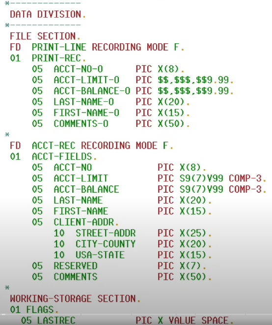

# COBOL - Common - Businesss Orientation Language
COBOL Reserved words - READY, END, FILE ...
# COBOL Division
Divisions -> Sections -> Paragraphs -> Sentences -> Statements
# COBOL Variables
NUMERIC, ALPHABETIC, ALPHANUMERIC
# Data Division
